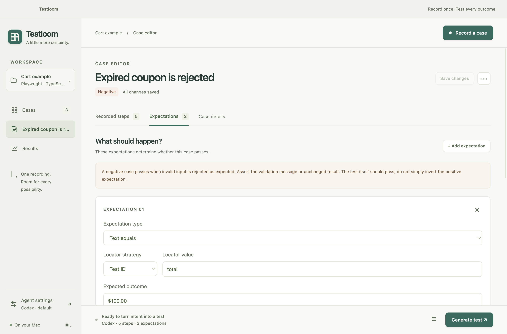
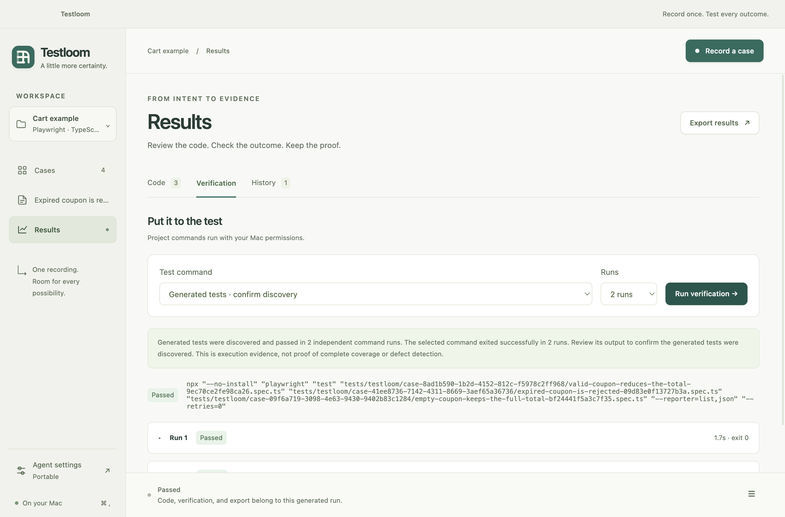

<p align="center"></p>

# Testloom

**Turn a browser journey into a test suite you can edit, run, and keep.**

Testloom is an open-source Mac workspace for people who know how an application should behave. Connect your local test project, record a flow, and spell out the expected result. Use Codex to adapt tests to your project, Claude Code as an alternative, or portable Playwright templates without an AI account. Review the code and execution evidence, then take the tests back to your repository.

**v0.2.1 is an ad-hoc signed Apple Silicon developer preview, without Apple notarization.** It repairs the incomplete bundle signature in v0.2.0. See [Mac installation help](docs/MAC-OPENING.md), [release assets](https://github.com/saketh12e/testloom/releases/tag/v0.2.1), and the version-specific [validation record](docs/VALIDATION.md).


- **Build a reusable library.** Keep up to 500 cases per project; select 1–20 enabled cases for a generation batch.
- **Cover success, rejection, and boundaries.** Duplicate a case, edit inputs, locators and assertions, and organize it with tags, priority and enabled status. An expected rejection is a passing test when the asserted behavior occurs.
- **Keep the evidence.** Editing a case preserves its original recording. Generated files have separate case folders, and the latest 100 generation records remain in project history.
- **Control agent context.** Choose the provider, model, effort and time budget; review instructions and the prompt, exclude source excerpts, and set a Claude dollar cap. [Agent controls](docs/AGENTS.md) explains the boundaries.
- **Own the output.** Import/export portable JSON suites and export ordinary test code, a patch, and available verification evidence. Running exported tests needs neither Testloom nor another model call.

## Try it on your Mac

Use **Node.js 20.19+** for the cart demo and npm projects. From a source checkout:

```sh
git clone https://github.com/saketh12e/testloom.git
cd testloom
npm ci
npm run browsers
npm start
```

Previously named JourneyProof. The [original repository URL](https://github.com/saketh12e/journeyproof) redirects here; existing local folders can keep their names.

For a packaged preview, download the **v0.2.1 Apple Silicon** asset from Releases, unzip it and move **Testloom.app** to Applications. It is not Apple Developer signed or notarized. Follow [Mac installation help](docs/MAC-OPENING.md) to verify the download and open a trusted preview; keep system-wide protections enabled.

1. Open **Try the cart demo**. It includes three hand-authored cases for valid, invalid and empty coupons.
2. Review the cases, select them, choose **Portable**, and generate the batch.
3. Review the files, use **Generated tests · confirm discovery**, and inspect every run.
4. Record your own journey: add the $40 notebook and $60 bag, apply **SAVE10**, then stop. Add the requirement that `total` shows **$90.00**.
5. Edit or duplicate the saved case and export the suite or evidence bundle.

For Codex, install the [official CLI](https://developers.openai.com/codex/cli), run `codex login`, and refresh agent availability in Testloom. Claude uses your separately installed and authenticated Claude Code CLI. Testloom supplies no model credits and collects no API key. Model calls use your CLI configuration and account policies.



[Full walkthrough and troubleshooting](docs/GETTING-STARTED.md) · [Java example](examples/java/README.md) · [Suite format](docs/SCENARIO-FORMAT.md)

## Checked against a real defect

The v0.2 checks include actual Codex generation for positive and negative coupon cases, a three-case Portable batch, and three compiled Java cases. The healthy cart passes; the unchanged positive test catches a deliberately broken discount: **$90.00 expected, $95.00 received**. Original source hashes remain unchanged. See [Validation](docs/VALIDATION.md) for commands, environments and outcomes.



The preview has bounded recording/framework support and heuristic redaction. A source copy is **not an OS sandbox**: trusted test scripts and browser actions run with your permissions. Review prompts, generated assertions and exports; a passing run establishes the checked behavior, not complete coverage. [Limitations](docs/LIMITATIONS.md) and [Roadmap](docs/ROADMAP.md) explain the remaining work.

## Build with us

MIT licensed. Read [Contributing](CONTRIBUTING.md), [Architecture](docs/ARCHITECTURE.md), [Research](docs/RESEARCH.md), and [Security](SECURITY.md). Upgrading from JourneyProof? Existing data and `.journeyproof` paths are intentionally retained; follow [Migration](docs/MIGRATION.md).
