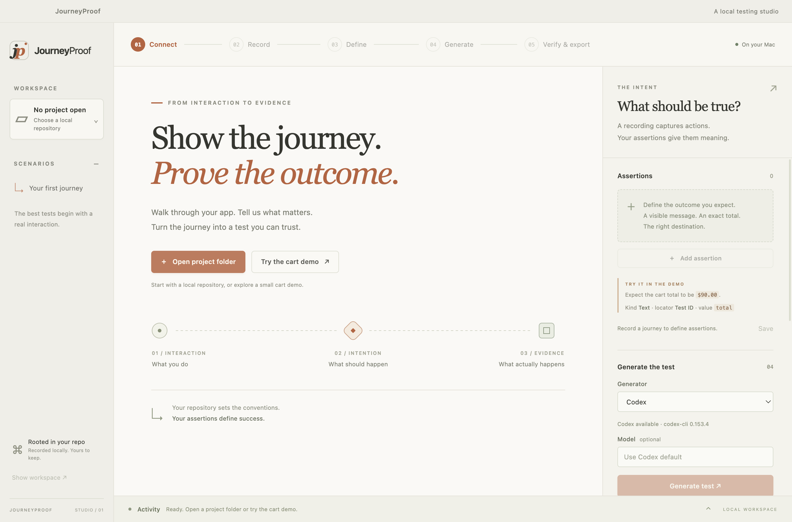

<p align="center"></p>

# JourneyProof

### Show the journey. Prove the outcome.

**A Mac testing workspace that turns a browser demonstration and an explicit requirement into tests for your local codebase.** Record the flow, define what should be true, let Codex adapt the test to your project, and inspect the execution evidence.

[Download for Apple Silicon](https://github.com/saketh12e/journeyproof/releases/tag/v0.1.0) · [Five-minute walkthrough](docs/GETTING-STARTED.md) · [Research & design](docs/RESEARCH.md) · [Validation](docs/VALIDATION.md)



## What it does

- **Connect a folder.** Inspect the framework, build commands, existing tests, helpers and configuration. No repository upload or Git requirement.
- **Record a real browser.** Capture ordered actions, locator candidates, navigation and request metadata in an open [scenario format](docs/SCENARIO-FORMAT.md). Sensitive fields are redacted; screenshots are optional.
- **Make the expectation explicit.** Keep business requirements separate from observed behavior. A buggy total must not become the expected total.
- **Generate reviewable tests.** Use your installed Codex CLI and account, or the deterministic Playwright TypeScript / Java generator. Review new files before running them.
- **Verify and hand off.** Run in an isolated source copy, repeat checks, confirm generated Playwright test discovery, and export the scenario, patch and execution evidence bound to generated file hashes.

The connected folder is not edited by generation. The exported tests are ordinary code that runs without JourneyProof or an AI call.

## Try it

The **Apple Silicon preview** is available in [Releases](https://github.com/saketh12e/journeyproof/releases/tag/v0.1.0). Unzip and move JourneyProof to Applications. The preview is not signed with an Apple Developer identity or notarized; macOS may require **System Settings → Privacy & Security → Open Anyway** for the downloaded app. The source build is also available below. Do not disable system-wide security controls.

Install **Node.js 20.19+** for the sample and npm-based projects. Install [Codex CLI](https://developers.openai.com/codex/cli) and run `codex login` to use Codex mode. JourneyProof collects no API key and supplies no model credits. Your existing Codex configuration controls account access and model usage. Portable mode needs no AI account.

From source:

```sh
git clone https://github.com/saketh12e/journeyproof.git
cd journeyproof
npm ci
npm run browsers
npm start
```

In the app:

1. Select **Try the cart demo**, then **Start recording**.
2. Add the **$40 Field notebook** and **$60 Canvas bag**. Apply **SAVE10**.
3. Return to JourneyProof and stop recording. Review the prefilled requirement: `total` must show **$90.00**.
4. Select **Codex** or **Portable generator**, then **Generate test**.
5. Review the file, run verification, and export the bundle.

Chromium can be installed with `npm run browsers` from the source folder. The recorder can use an installed Google Chrome as a fallback. The test runner may still require its pinned Playwright Chromium. See the [walkthrough and troubleshooting](docs/GETTING-STARTED.md).

## Supported in 0.1

| Area | Current scope |
| --- | --- |
| Desktop | Native Electron app; Apple Silicon package exercised on macOS 26.5.1. Intel builds are available from source but not validated here. |
| Agent | Installed Codex CLI, noninteractive structured generation, read-only sandbox. Claude adapter is not implemented. |
| Portable tests | Playwright TypeScript and Playwright Java / JUnit 5. Java example pins the published Java package version 1.62.0. |
| Existing projects | npm, Maven and Gradle detection; Playwright and Selenium clues; bounded source context for Codex adaptation. Detection is not universal framework support. |
| Evidence | Ordered ledger, explicit assertions, optional local screenshots, patch, per-run output, generated file hashes, Playwright discovery checks. |

This is a **working developer preview**, with explicit [limitations](docs/LIMITATIONS.md). It does not cover every browser interaction, prove every business rule, or guarantee stable tests on arbitrary projects.

## Evidence over claims

The release checks include a real browser recording, native desktop generation and execution, an actual Codex-generated test, and a compiled Java test. The coupon tests pass against the healthy cart and fail against a disclosed mutation that returns **$95 instead of $90**. The regression suite covers privacy filtering, path boundaries, immutable exported test bytes, process-tree cancellation, skipped-test detection and recorder shutdown. Exact commands and outcomes are in [Validation](docs/VALIDATION.md).

```sh
npm run check          # types, regression tests, production build
npm run test:journey   # real recording → generated test → pass and mutant failure
npm run test:desktop   # actual native desktop flow; requires a graphical Mac session
```

[Java walkthrough](examples/java/README.md) · [Cart fixture](examples/cart/README.md) · [Architecture](docs/ARCHITECTURE.md) · [Scenario schema](schemas/scenario-v1.schema.json)

## Trust boundaries

Recording is local. Codex mode sends the scenario and selected source excerpts through your Codex configuration. Screenshots stay local unless you export them. Redaction is heuristic: review the context and artifacts before using confidential data.

A source copy is **not an OS sandbox**. Verification runs trusted repository commands with your local user permissions; scripts and browser workflows can have effects outside the copy. The recommended Playwright command checks actual test discovery. Custom commands report their exit status and require manual confirmation that the intended tests ran. Passing execution is not proof of complete requirement coverage.

## Contribute

The project is MIT licensed. Start with [CONTRIBUTING.md](CONTRIBUTING.md), the [architecture](docs/ARCHITECTURE.md), and [research decisions](docs/RESEARCH.md). Useful next contributions include additional runner adapters, an isolated recorder world, richer fixture mapping, and carefully bounded repair proposals that preserve requirements. Please include a failing reproduction and execution evidence with behavioral changes.

[Security policy](SECURITY.md) · [MIT license](LICENSE)
