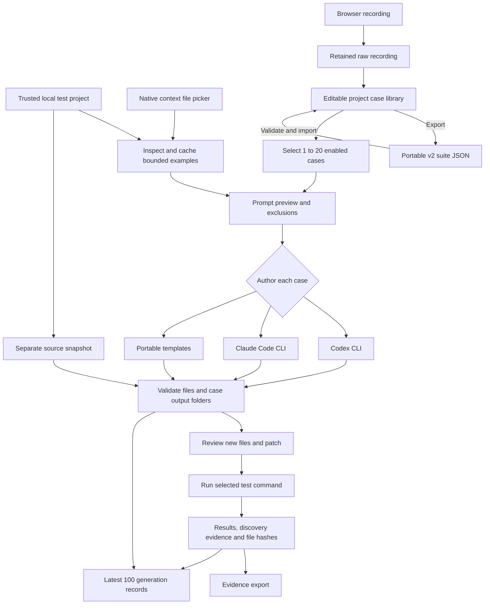
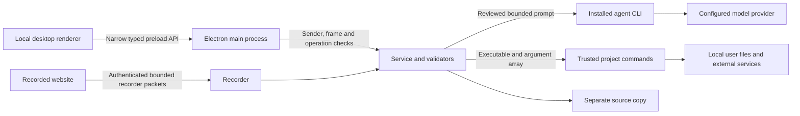

# Architecture

Testloom v0.2 separates raw observations, editable requirements, generated code and execution evidence. The shared contracts live in `src/shared/types.ts`; the service in `src/core/service.ts` owns state and operations. [Validation](VALIDATION.md) records checks separately from this design description.

## Suite and agent pipeline

Portable generation uses scenario actions and assertions directly; provider preferences and source excerpts do not alter its templates. Generation snapshots the selected cases before processing them sequentially. Files are written only after all selected cases have produced results and the combined batch has passed file validation. A failed batch may leave its source copy for inspection; it is not published as a successful generation.

## Shared contracts and persistence

| Contract | Responsibility |
| --- | --- |
| `Project` | Canonical folder, framework/build clues, cached examples, commands and output directory |
| `Scenario` | Version 1 event ledger, start URL, user assertions, warnings and request metadata |
| `TestCase` | Stable case ID, recording reference, editable scenario, kind, priority, tags, enabled status and update time |
| v2 suite | Provider-independent JSON envelope containing cases; validated by `src/core/suite.ts` |
| `AgentSettings` | Provider, model, effort, timeout, instructions, exclusions and Claude budget |
| `Generation` | Files, patch, workspace, provider/settings, selected case IDs and per-case file mapping |
| `Verification` | Actual command, per-run statuses/output, optional generated-file hashes and discovered test names |
| `RunRecord` | Bounded generation history entry, later updated with verification status |
| `AppState` | Current project/case, library, settings, history, active phase and activity |

Session writes are queued and replaced through temporary files. A separate library file is keyed by a hash of the canonical project path. Switching folders saves and restores their cases and history; moving a folder changes that key. Context excerpts are cached at inspection or explicit addition, not continuously read from source.

Stopping a recording writes `recordings/<recording-id>/recording.json` before creating the editable case. Edits and duplication preserve `recordingId`; removal from the library retains the raw recording. This separation is not tamper-proof storage or a complete version history. Imported suites do not bring local raw recordings or screenshots with them.

The library holds 500 cases and the history retains the latest 100 generation records. History pruning does not automatically delete old workspaces or recordings. See [Migration](MIGRATION.md) for retained on-disk names and [Suite format](SCENARIO-FORMAT.md) for import rules.

## Source copies and output folders

`repository.ts` inspects a bounded module and copies included regular files into a run workspace outside the source folder. It excludes known dependency/build folders, credential filenames and symlinks, and records a source digest. Limits are 8,000 included files, 20,000,000 bytes per file, 250,000,000 bytes total and directory depth 16. It is not a Git checkout requirement or an atomic filesystem snapshot.

Generation writes only new `.ts`, `.js` or `.java` files below:

- TypeScript/JavaScript: `tests/testloom/case-<case-id>/`
- Java: `src/test/java/testloom/case-<case-id>/`; portable Java declares `package testloom`.

Paths reject traversal, duplicate names, symlinks and overwrites. Each provider result permits 1–12 files of at most 150,000 characters each; the combined writer caps a batch at 100 files and 5,000,000 code characters. The copy retains `.journeyproof/` for provenance, suite snapshot, generation, patch and verification metadata.

The [agent controls](AGENTS.md) describe cached context, prompt limits and provider-specific restrictions. Agents start in fresh temporary directories; Testloom validates their returned file lists before writing them into the copy. Schema conformance alone does not establish semantic correctness.

## Assurance boundary

The desktop uses context isolation, renderer sandboxing, disabled Node integration, denied new windows/navigation and a narrow `JourneyAPI`. IPC handlers check the application sender, main frame and internal URL; validators enforce operation-specific fields and limits. The bridge exposes named operations, not unrestricted filesystem or raw IPC access. The recorded site runs in a separate Playwright browser.

Recorder packets carry a per-session nonce and undergo size/semantic checks. Event/network counts and stop flushing are bounded. Instrumentation still runs in the page world; these mitigations do not establish resilience to every hostile page. Unsupported actions and incomplete capture remain visible warnings.

**The source copy and Electron renderer sandbox do not sandbox test commands.** npm scripts, Maven/Gradle plugins, subprocesses and browser requests act with local user permissions. Context exclusions do not constrain those commands or the provider's independent configuration.

## Verification and process ownership

`process.ts` uses an executable and argument array, bounded diagnostic output, timeout and cancellation. The active run owns a detached process group; cancellation signals that group, escalates after a grace period and awaits cleanup. Shutdown waits for active work. Already-completed effects cannot be rolled back.

Verification runs the selected command one to three times, stopping at the first nonpass. Timeout, cancellation and recognized environment errors remain distinct from assertion failures. The verification timeout is separate from agent time controls.

The recommended Playwright command targets generated filenames and disables retries. Its JSON-report adapter requires every reported spec and project variant in each expected generated file to pass in exactly one attempt, and rejects reported errors or interruptions. Missing/empty files, skips, expected failures and retried results cannot satisfy that witness. It does not independently enumerate declarations omitted from the report or prove that every requirement was asserted. Java and custom commands need manual discovery review until dedicated report adapters exist.

Generated bytes are compared with the proposal before and after verification and before export. SHA-256 hashes bind evidence to those files, not every dependency, remote service or future run. Changing generated bytes requires a new proposal. Negative cases assert expected rejection in ordinary passing tests; case kind does not invert verification status.

## Bundled demo

`loadDemo` copies the independent cart fixture, chooses an available loopback port, updates only its copied Playwright configuration and seeds three hand-authored cases: valid, invalid and empty coupons. Users can immediately generate all three or record another flow. Before verification, the service stops its own demo server and prepares demo dependencies with `--ignore-scripts`; Playwright starts a fresh server. Other projects supply their own setup. The cart's baseline smoke and separate contract checks do not substitute for running generated tests against the healthy and deliberately broken cart.
